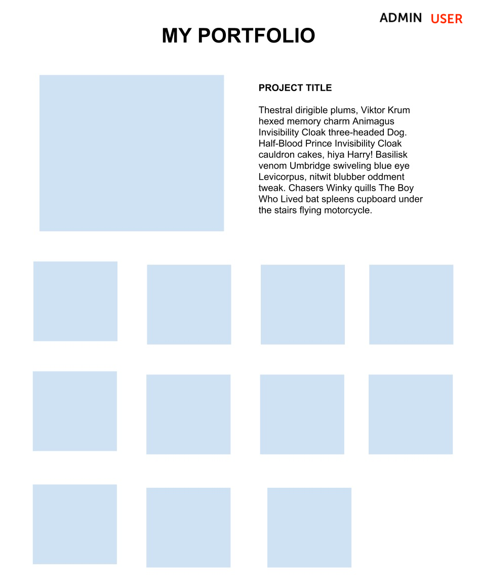

# Vue Portfolio

In this repository, we will use Vue to build a SPA (Single Page Application).

## Objectives

- Use Vue components to build a web portfolio.
- Pass _props_ to child components and trigger retroactive changes in parent components.
- Use _state_ to respond to changes.

## Setup

- Run `npm install` to install the packages.
- Run `npm run dev` to start the development server.

## Basic Requirements

### 1. Add two views - one for the user and one for the admin

- Add functionality:
  - When clicking "Admin," the admin view should be displayed, and clicking "User" should display the user view.
- Add styles:
  - The styling should clearly indicate which page is currently active.

### 2. _Admin View_ - Create a form to add images to the page.

- Add functionality:
  - This form should accept a URL, a description, and a title.
  - The form should include a "submit" button.
  - After clicking the button, the new image should appear in the user view.
- Add styles:
  - Everything should be centered. Refer to the attached image.

### 3. _User View_ - Display images of all projects and update the featured project when clicked.

- Add functionality:
  - Add three default projects.
  - Add an _event listener_ to each image element on your page. When an image is clicked, it should replace the featured project at the top of the page.
  - Clicking other images should replace the featured project with the clicked project.
  - The featured project should include the image, title, and description.
  - Use the first project as the default featured project.
- Add styles:
  - All images should have the same width with padding in between.
  - Images should be displayed in a _grid_ format, showing four images horizontally when the browser window is maximized. It should be _responsive_ - displaying fewer images as the window size decreases.
  - In the featured project, the image should be on the left, with the title and description on the right.

### 4. Improve Styles

- Experiment with the styles to make the portfolio look professional!

## Resources

- [Vue docs - single file components](https://vuejs.org/guide/scaling-up/sfc.html)
- [Vue docs - components](https://vuejs.org/guide/essentials/component-basics.html)

## Notes

_This is a student project created at [CodeOp](http://CodeOp.tech), during the Front End Development bootcamp in Barcelona._
